# RPSLS game

RPSLS game it a site that wants to provide a challenging game to the users. The site will be targeted toward people who want to play a luck based game. RPSLS game its a fully responsive Javascript Rock-Paper-Scissors-Lizard-Spoke game that will allow users to play with their usernames, or as guests it they don't want to, on different game modes and difficulties.

Link to the deployed site [here](https://paaulcb.github.io/RPSLS-Game/).

## Features

### Existing Features

- _Header_

  - On the header the users can find the name of the game and also by clicking on it they go back to the top of the page.

    

- _Game menu_

  - The main purpose of the game menu it's to set up the game, check previous results and learn how to play.

  

  - Within the menu you will find the username input, guest checkbox, start button, mode and difficulty selectors, history and how to play, all of them explained below:

    - _Username input and guest checkbox_

      - The purpose of the username input and guest checkbox it's to give the user the option to choose their username or, if they don't want to, to play as guest.
      - If they want to use their username, it needs to have between 4-11 characters, otherwise they can't start the game and a error message will appear.

        

      - If they want to play as guest, when they check the checkbox, the username input will be hidden.

        

    - _Start button_

      - The purpose of this button it's to start the game.

        

      - When clicked, starts the game if the guest checkbox its checked or if the username it's valid, otherwise will show a error message requiring a valid username.

    - _Difficulty selector_

      - Here they can choose the difficulty of the game, being 1 the easy and 3 the hard.

        

      - On difficulty 1 the user have 25% extra chance to win.
      - On difficulty 2 the user have the same chance of winning as losing.
      - On difficulty 3 the user have 25% extra chance to lose.

    - _Mode selector_

      - Here they can choose the mode of the game.

        

      - BO3: Best of three, first to win two rounds wins.
      - BO5: Best of five, first to win three rounds wins.
      - Until5: The game ends when the cpu wins 5 rounds.

    - _History_

      - The purpose of the history it's to keep track of the games that the users plays.
      - The first time when they open the game the history option will not be visible.

        

      - After they play a game they can check the results buy clicking on History, where they will find the username, score, mode and difficulty.

        

      - Once the history it's open, clicking on the x button or on history will close the history table.

    - _How to play_

      - The purpose of this feature it's to show the instructions and the difference between the diferents game modes to the user.

        

      - Once you click on how to play, the instructions will appear, once you click again on it or on the X button, the instruccions will hide.

- _Game area_

  - Here it's where the game its played. Inside the game area we have the features explained below:

    - _Round results_

      - The main purpose of the round results it's to show the users if they won the round or not.
      - Here we have a player area and a cpu area where shows the names, current scores and the selected pick.
      - Initially the scores are setted to 0 and the picks to "?".

        

      - Once they pick an option, a message will appear indicating if the win, lose or tie, along with a highlight style on the winner site. Also the socre it's updated.

        

    - _Pick buttons_

      - This allow the users to pick thier options.

        

      - The buttons have a hover style on them, for medium and larger screens,and for smallers they have the syme style but in a on click event.

        

      - Once they pick an option all the buttons will be disabled for 0.5 seconds to prevent clicking twice by mistake.

        

      - Once the game finish the buttons will remain disabled until the users are sent to the game menu.

    - _Gameover message_

      - Once the game it's over, a 3 seconds countdown message will apper below the buttons to let the users know that the game it's over and that they are been sent back to the game menu.

        

- _Footer_

  - The footer includes links to Discord and Github game repository. Both of them opens a link in a new tab.

    

  - The github repository will allow the users to check the code used for this game.
  - Discord will allow users to share keep connected by sharing they results and meeting others users that's play the game.

## Design

### Wireframe

- This are a hand-draw wireframe of the game menu and game area in different screen sizes.

  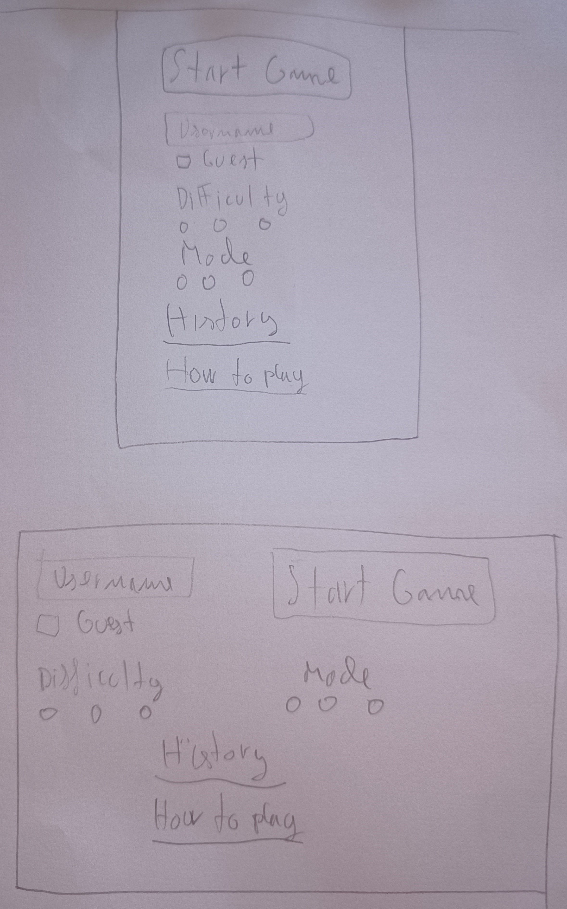
  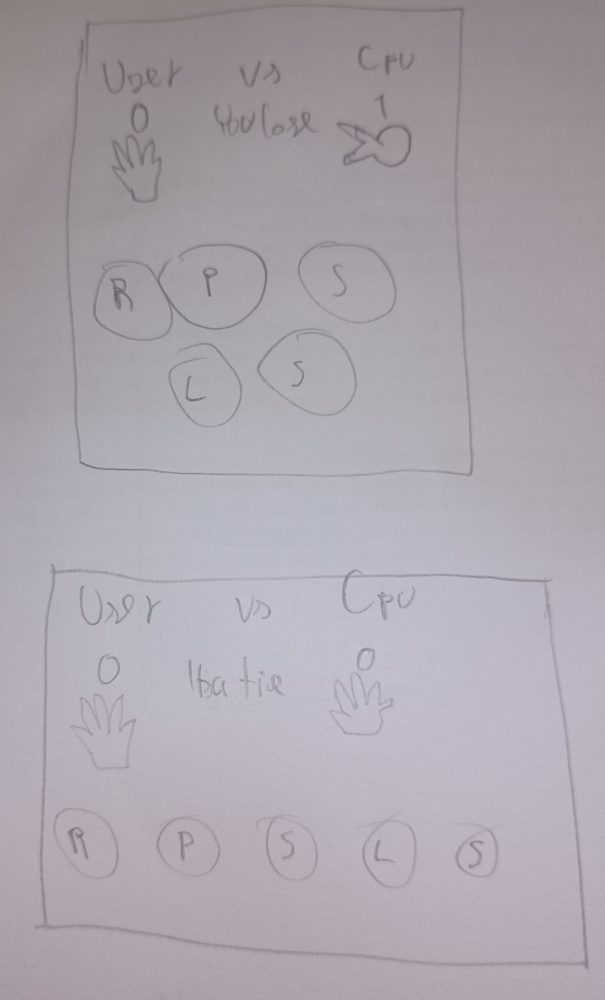

### Font and colors

- _Fonts_

  This are the fonts used for this game

  - Paytone One
  - Pridi
  - Roboto Mono

- _Colors_

  This are the color used for this game

  - #091620 
  - #16933b 
  - #5c3c62 
  - #7A5980 
  - #7A598080 
  - #7ed0b3 
  - #C2E7DA 
  - #db5c5c 
  - #000 
  - #00000080 

## Testing

### Manual testing

- _Resizing_
  - Resizing to the differents screen sizes it show the content as intended
- _Header_
  - Clicking the game title it goes back to the top of the page.
- _Game area_
  - Checking "Play as guest" delete the content on the username input and hides it. On medium and larger screens also center "Play as guest" to cover the space of the hidden input.
  - Unchecking "Play as guest" shows the username input again and focus it.
  - Clicking "Start game!" with "Play as guest" checked starts a game with a guest username.
  - Clicking "Start game!" with a username that do not have between 4-11 characters will delete the content on the username input, will focus it, will show a error message below the input and will change the input placeholder text.
  - Checking and unchecking "Play as guest" after the error message it's shown will hide the error message.
  - Clicking "Start game!" with a valid username starts a game with that username.
  - Clicking "Start game!" with difficulty "1" selected and mode "BO3" selected starts a "BO3" game with difficulty "1".
  - Clicking "Start game!" with difficulty "1" selected and mode "BO5" selected starts a "BO5" game with difficulty "1".
  - Clicking "Start game!" with difficulty "1" selected and mode "Until5" selected starts a "Until5" game with difficulty "1".
  - Clicking "Start game!" with difficulty "2" selected and mode "BO3" selected starts a "BO3" game with difficulty "2".
  - Clicking "Start game!" with difficulty "2" selected and mode "BO5" selected starts a "BO5" game with difficulty "2".
  - Clicking "Start game!" with difficulty "2" selected and mode "Until5" selected starts a "Until5" game with difficulty "2".
  - Clicking "Start game!" with difficulty "3" selected and mode "BO3" selected starts a "BO3" game with difficulty "3".
  - Clicking "Start game!" with difficulty "3" selected and mode "BO5" selected starts a "BO5" game with difficulty "3".
  - Clicking "Start game!" with difficulty "3" selected and mode "Until5" selected starts a "Until5" game with difficulty "3".
  - Once the first game it's over "history" option will appear on the game menu, before that will be hidden.
  - Clicking on "History" will show the history table with the information about the previous games.
  - Clicking on "History" again or on the X button will close the history table.
  - Clicking on "How to play" will show the game instructions.
  - Clicking on "How to play" again or on the X button will hide the instructions.
- _Game area_
  - Clicking the rock button pick the rock for the user and shows it below the user score.
  - Clicking the paper button pick the paper for the user and shows it below the user score.
  - Clicking the scissor button pick the scissor for the user and shows it below the user score.
  - Clicking the lizard button pick the lizard for the user and shows it below the user score.
  - Clicking the spoke button pick the spoke for the user and shows it below the user score.
  - When clicking any of the options:
    - Disable all the buttons for 0.5 seconds.
    - CPu pick will appear on the Cpu area.
    - If the user wins, the user area it's highlighted, it score it's incresed and a winning message appears below "vs".
    - If the user lose, the CPU area it's highlighted, it score it's incresed and a losing message appears below "vs".
    - If it's a tie, remove the highlight style and show a tie message.
    - If the game its over, disable the buttons for 3 seconds and shows a 3 seconds countdown message below the options that returns to the game menu when the countdown its over.

### Validator testing

- _HTML_
  - No errors were returned when passing through the official [W3C validator](https://validator.w3.org/nu/?doc=https%3A%2F%2Fpaaulcb.github.io%2FRPSLS-Game%2F)
- _CSS_
  - No errors were found when passing through the official [(Jigsaw) validator](https://jigsaw.w3.org/css-validator/validator?uri=https%3A%2F%2Fpaaulcb.github.io%2FRPSLS-Game%2F&profile=css3svg&uem=all&warning=1&vextwarning=&lang=en)
- _JS_

  - No errors were found when passing through [JShint](https://jshint.com/) validator.

    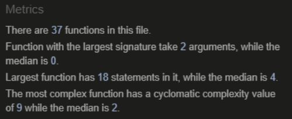

- _Lighthouse report_

  Lighthouse report results that we run in incognito mode

  

### Fixed Bugs

- When the user checked the guest checkbox and after that resize the screen and uncheck the checkbox, the layout didn't show as intented. I fixed it creating guestLayout function and adding it on a resize event (Commit **6d8e884**).
- After customizing the radio buttons, I found a bug that when clicking BO3 in the mode selector, bo5 was selected and not BO3. The problem was that i had the attribute "for" on the BO3 label, pointing at BO5. I fixed by putting the correct "for" attribute (Commit **d2b3b5b**).
- I found that the layout was not displayed correctly when resizing the window, but it looked fine from dev tools view. I fixed it by changing the way i was checking the screen size.

  Instead of:

  > screen.width

  I used:

  > window.innerWidth

  (Commit **8bb3ba9**)

- Hover styles didn't work as intetnded on smaller screens. I fixed it by moving the hover styles to medium and larger screens, and adding the hover styles with a onclick event on the buttons for smaller screens. (Commit **a805c9d**)
- The Favicon didn't work on the deployed version. The problem was that a genereted the favicon with a incorrect path. I fixed it by genereting again the favicon with the correct path. (Commit **eef6e93**)

### Unfixed Bugs

## Deployment and Local Development

### Deployment

The site was deployed to GitHub pages. The steps to deploy are as follows:

1. In the GitHub repository, navigate to the Settings tab.

   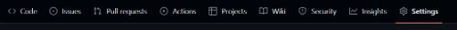

2. In the left menu go to **Pages**.

   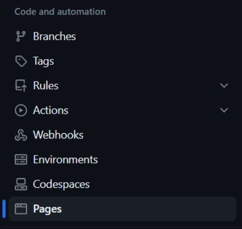

3. From the source section drop-down menu, select Deploy from a branch.

   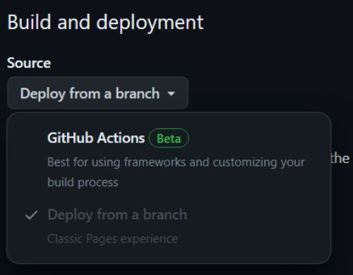

4. In the branch section select **main** and folder **/(root)**, then press save.

   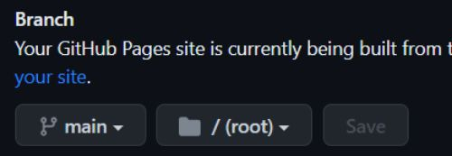

5. The page will be automatically refreshed with a detailed ribbon display to indicate the successful deployment.

   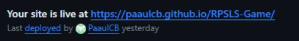

### How to clone the repository

1.  Go to [RPSLS Game](https://github.com/PaaulCB/RPSLS-Game).
2.  Above the list of files, click **Code**.

    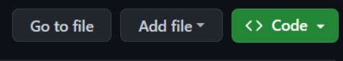

3.  Copy the URL for the repository.

    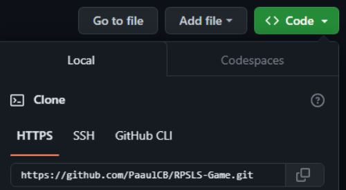

4.  Open Git Bash.
5.  Change the current working directory to the location you want the cloned directory.
6.  Type **git clone**, and then paste the URL you copied earlier.

         git clone https://github.com/PaaulCB/RPSLS-Game.git

7.  Press **Enter** to create your local clone.

    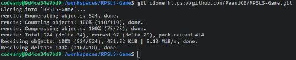

### How to fork the repository

1. Go to [RPSLS Game](https://github.com/PaaulCB/RPSLS-Game).
2. In the top-right corner of the page, click **Fork**.

   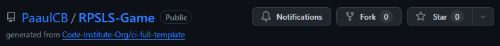

3. Under "Owner," select the dropdown menu and click an owner for the forked repository.
4. By default, forks are named the same as their upstream repositories. Optionally, to further distinguish your fork, in the "Repository name" field, type a name.
5. Optionally, in the "Description" field, type a description of your fork.
6. Optionally, select **Copy the DEFAULT branch only**.
7. Click **Create fork**.

## Credits

### Content

- The code to add border to the text on the start button was taken from [stackoverflow](https://stackoverflow.com/questions/2570972/css-font-border).
- The code to make the footer stay at the bottom of the page was taken from [stackoverflow](https://stackoverflow.com/questions/643879/css-to-make-html-page-footer-stay-at-bottom-of-the-page-with-a-minimum-height-b).
- The idea of how to fix the warning "Functions declared within loops referencing an outer scoped variable may lead to confusing semantics." was taken from my mentor. (Commit **4c2d939**).
- The code to customize the radio buttons and the checkbox was taken from [w3schools](https://www.w3schools.com/howto/howto_css_custom_checkbox.asp).
- The icons used on this game were taken from [Font Awesome](https://fontawesome.com/).
- [Fontjoy](https://fontjoy.com) was used to choose the font families for this project.
- [Coolors](https://coolors.co/) was used to choose the colors for this project.
- [Birme](https://www.birme.net/) was used to crop and change the format of the images.
- The [README.md](https://github.com/PaaulCB/worlds-rabbits/blob/main/README.md) from my last proyect was used as template for this one.
- The steps to fork a repository were taken from [github docs](https://docs.github.com/en/get-started/quickstart/fork-a-repo).
- The steps to clone a repository were taken from [github docs](https://docs.github.com/en/repositories/creating-and-managing-repositories/cloning-a-repository).

### Media

- The image used for the favicon was taken from [here](https://cdn-icons-png.flaticon.com/512/6793/6793733.png).
