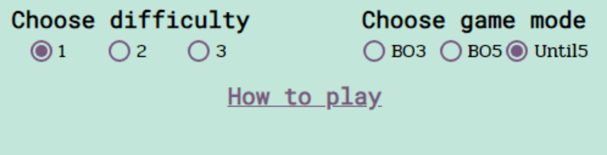
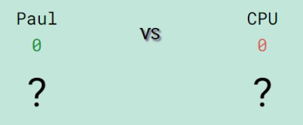

# RPSLS game

RPSLS game it a site that wants to provide a challenging game to the useres who want to play a luck based game.

[RPSLS game](https://paaulcb.github.io/RPSLS-Game/)

## Features

### Existing Features

- _Header_

  - On the header the users can find the name of the game and also by clicking on it they go back to the top of the page.

    

- _Game menu_

  - The main purpose of the game menu it's to set up the game, check previous results and learn how to play.

  

  - Within the menu you will find the username input, guest checkbox, start button, mode and difficulty selectors, history and how to play, all of them explained below:

    - _Username input and guest checkbox_

      - The purpose of the username input and guest checkbox it's to give the user the option to choose their username or, if they don't want to, to play as guest.
      - If they want to use their username, it needs to have between 4-11 characters, otherwise they can't start the game and a error message will appear.

        

      - If they want to play as guest, when they check the checkbox, the username input will be hidden.

        

    - _Start button_

      - The purpose of this button it's to start the game.

        

      - When clicked, starts the game if the guest checkbox its checked or if the username it's valid, otherwise will show a error message requiring a valid username.

    - _Difficulty selector_

      - Here they can choose the difficulty of the game, being 1 the easy and 3 the hard.

        

      - On difficulty 1 the user have 25% extra chance to win.
      - On difficulty 2 the user have the same chance of winning as losing.
      - On difficulty 3 the user have 25% extra chance to lose.

    - _Mode selector_

      - Here they can choose the mode of the game.

        

      - BO3: Best of three, first to win two rounds wins.
      - BO5: Best of five, first to win three rounds wins.
      - Until5: The game ends when the cpu wins 5 rounds.

    - _History_

      - The purpose of the history it's to keep track of the games that the users plays.
      - The first time when they open the game the history option will not be visible.

        

      - After they play a game they can check the results buy clicking on History, where they will find the username, score, mode and difficulty.

        

      - Once the history it's open, clicking on the x button or on history will close the history table.

    - _How to play_

      - The purpose of this feature it's to show the instructions and the difference between the diferents game modes to the user.

        

      - Once you click on how to play, the instructions will appear, once you click again on it or on the X button, the instruccions will hide.

- _Game area_

  - Here it's where the game its played. Inside the game area we have the features explained below:

    - _Round results_

      - The main purpose of the round results it's to show the users if they won the round or not.
      - Here we have a player area and a cpu area where shows the names, current scores and the selected pick.
      - Initially the scores are setted to 0 and the picks to "?".

        

      - Once they pick an option, a message will appear indicating if the win, lose or tie, along with a highlight style on the winner site. Also the socre it's updated.

        

    - _Pick buttons_

      - This allow the users to pick thier options.

        

      - The buttons have a hover style on them, for medium and larger screens,and for smallers they have the syme style but in a on click event.

        

      - Once they pick an option all the buttons will be disabled for 0.5 seconds to prevent clicking twice by mistake.

        

      - Once the game finish the buttons will remain disabled until the users are sent to the game menu.

    - _Gameover message_

      - Once the game it's over, a 3 seconds countdown message will apper below the buttons to let the users know that the game it's over and that they are been sent back to the game menu.

        

- _Footer_

  - The footer includes links to Discord and Github game repository. Both of them opens a link in a new tab.

    

  - The github repository will allow the users to check the code used for this game.
  - Discord will allow users to share keep connected by sharing they results and meeting others users that's play the game.

## Design

### Wireframe

### Font and colors

## Testing

### Manual testing

### Validator testing

- _HTML_
  - No errors were returned when passing through the official [W3C validator](https://validator.w3.org/nu/?doc=https%3A%2F%2Fpaaulcb.github.io%2FRPSLS-Game%2F)
- _CSS_
  - No errors were found when passing through the official [(Jigsaw) validator](https://jigsaw.w3.org/css-validator/validator?uri=https%3A%2F%2Fpaaulcb.github.io%2FRPSLS-Game%2F&profile=css3svg&usermedium=all&warning=1&vextwarning=&lang=en)
- _Lighthouse report_

  Lighthouse report results that we run in incognito mode

  

### Fixed Bugs

### Unfixed Bugs

## Deployment and Local Development

### Deployment

### How to clone the repository

### How to fork the repository

## Credits

### Content

### Media
